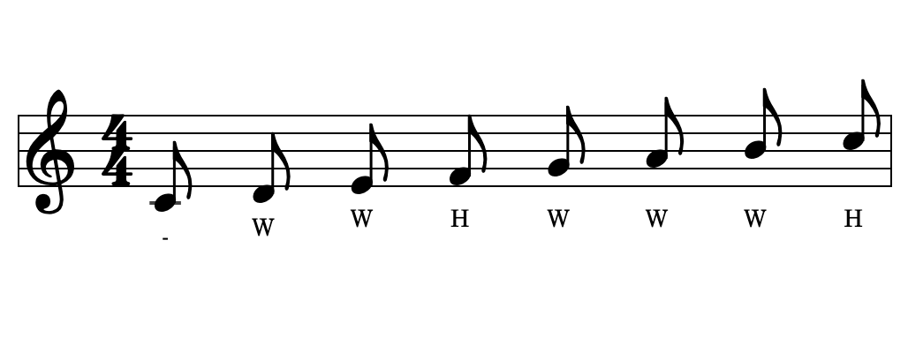
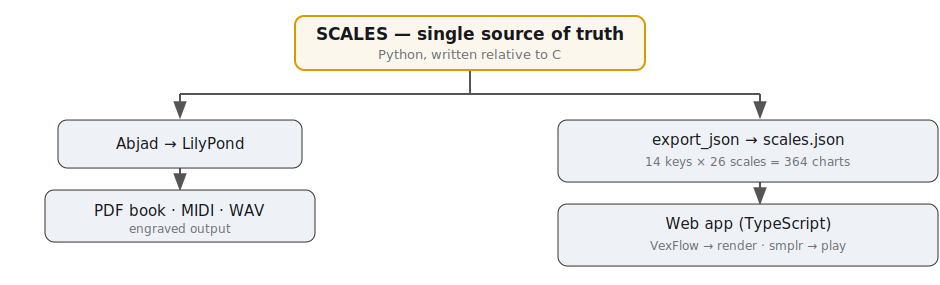
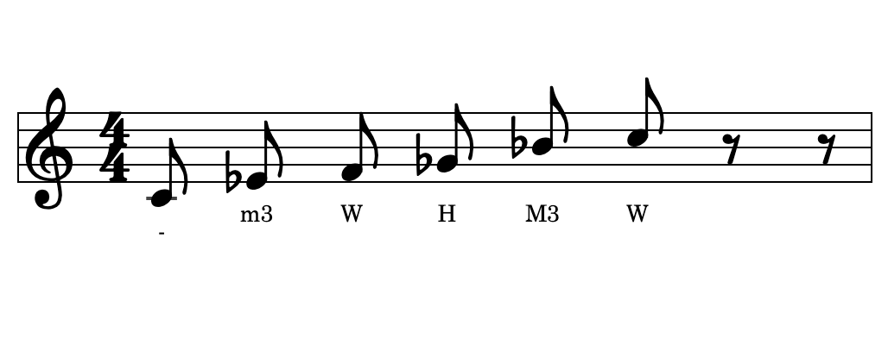
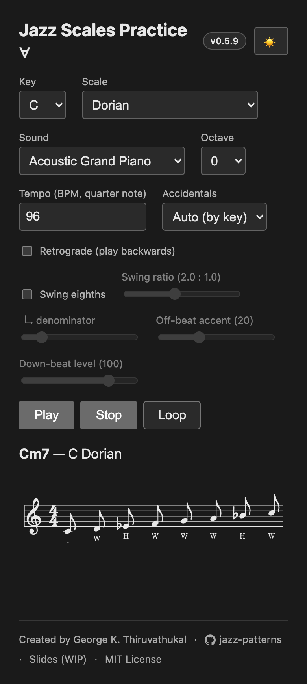
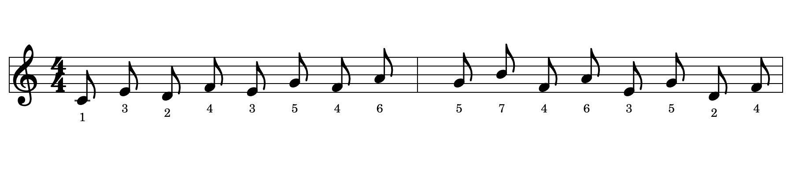

<!-- _class: lead dark -->
<!-- _paginate: false -->
<!-- _footer: "" -->

<span class="wip">🚧 Work in progress</span>

# Jazz Scales Practice ∀

## Open, generated practice material — every key, every scale, in print and in the browser

**George K. Thiruvathukal, PhD**<br>
Professor of Computer Science, Loyola University Chicago<br>
Visiting Computer Scientist, Argonne National Laboratory<br>
[gthiruvathukal@luc.edu](mailto:gthiruvathukal@luc.edu) · [gkt.sh](https://gkt.sh)

**[jazz-scales.gkt.sh](https://jazz-scales.gkt.sh/)** · MIT-licensed · [github.com/gkthiruvathukal/jazz-patterns](https://github.com/gkthiruvathukal/jazz-patterns)

---

<!-- _class: statement -->

# Scales are the alphabet of improvisation — yet practicing them in **all twelve keys** is harder than it should be.

---

## The problem

- Mastery means every scale in **all 12 keys** — forwards, backwards, by ear and by eye.
- The material to do that is **scattered, static, or paywalled**: a PDF you can't hear, an app you can't print, a book locked to one instrument.
- Students need it **gentle and visual**; pros need it **fast and complete**. Most resources serve one, not both.
- And you can't *hear* a printed page — or *print* most apps.

---

## Why I'm building this

> *I want one tool that helps a player — from a first-year student to a gigging pro — internalize the **sound and shape** of every scale, in every key. Free, open, and useful at the music stand or on a phone. As a pianist myself, I started by creating a tool that would be useful for my own piano practice.*

- **For musicians at all levels** — the same material scales from beginner drills to advanced modes.
- **See it and hear it** — notation you can read *and* play back.
- **Free & open for all, hence the ∀ symbol from mathematical logic** — no login, no account, no paywall. MIT-licensed.

If you find it useful, consider *sponsoring* me on GitHub or giving to Computer Science at Loyola University Chicago — links are in the project README.

---

## Principles

- **One source of truth.** The music theory lives in *one* place; everything else is generated.
- **Two deliverables, one model.** A printable book **and** an interactive web app.
- **All keys, all scales.** 14 key spellings × 26 scales = **364** ready charts.
- **Client-only.** The app runs entirely in the browser — no server, no tracking.
- **A living work.** As an active music student and professor, I am committed to maintaining and improving this app!
---

## One model → two outputs

<div class="cols">
<figure>

<figcaption>Print book — engraved with LilyPond</figcaption>
</figure>
<figure>

<figcaption>Web app — rendered with VexFlow</figcaption>
</figure>
</div>

**Same C-major data**, two renderers. Nothing is re-typed by hand.

---

## Architecture

<figure>

</figure>

**No music theory is duplicated downstream** — the web app is a renderer/player over resolved data.

---

## The data model

One row drives notation, audio, and the app — pitch classes 0–11, step labels `H·W·W+H·m3·M3` (W=Whole Tone, H=Half Tone/Semitone, W+H=Whole+Semitone, m3=Minor Third, M3=Major Third)

All scales are written in C and then *transposed* to all other keys.

```python
# generator.py
SCALES = [
    ("Major (Ionian)", ["C","D","E","F","G","A","B","C5"],
        ["W","W","H","W","W","W","H"], "Cmaj7"),
    ("Minor Pentatonic b5", ["C","Eb","F","Gb","Bb","C5"],
        ["m3","W","H","M3","W"], "Cm7(b5)"),   # M3 = 4 semitones — not m3
]
```

---

## … and the model catches real bugs

<div class="cols tight">
<div>

- `Gb → Bb` is **4 semitones** — a *major* third.
- Fix flows everywhere at once: **book, MIDI, and app**.

</div>
<figure>

<figcaption>Corrected labels, live in the app: m3 · W · H · <strong>M3</strong> · W</figcaption>
</figure>
</div>

---

## The JSON contract

`python -m jazz_scales.export_json` resolves every (key, scale) — the boundary between Python and TypeScript.

```json
{
  "key": "C", "scale": "Major (Ionian)", "chord": "Cmaj7",
  "intervals": ["W","W","H","W","W","W","H"],
  "notes": [
    { "name": "C", "octave": 4, "midi": 60, "sharp_name": "C", "flat_name": "C" },
    { "name": "D", "octave": 4, "midi": 62, "sharp_name": "D", "flat_name": "D" }
  ]
}
```

Note names *and* MIDI *and* enharmonic spellings — so the renderer never does theory.

---

## Notation in the browser

<div class="cols tight">
<div>

- **VexFlow** treble stave, 4/4, padded to whole measures.
- **Interval labels** under each note — or scale-degree numbers in the interval patterns.
- **Responsive SVG** — crisp at any width, phones included.

```ts
svg.setAttribute("viewBox", `0 0 ${w} ${h}`);
svg.style.width = "100%";       // must be .style:
svg.style.maxWidth = `${w}px`;  // VexFlow's inline
                                // style beats attributes
```

</div>
<figure>

<figcaption>C major, as rendered live</figcaption>
</figure>
</div>

---

## Hear it — playback & interaction

<div class="cols">
<div>

- **smplr Sequencer** — real transport: **play · pause · stop · loop**.
- **Instruments** — keys, mallets, guitar, **bass**, **horns & winds**, and a **Salamander grand piano**.
- **Octave** — a sensible default per instrument; nudge ±3 (playback only).
- **Playing-note highlight** — the score follows the sound.

*All "feel" controls change the audio only — never the printed notes.* (Interval patterns are next.)

▶ **Play it:** [jazz-scales.gkt.sh](https://jazz-scales.gkt.sh/)

</div>
<figure>

<figcaption>The full app at phone width</figcaption>
</figure>
</div>

---

## Intervals — hear the shapes

Play any scale in **diatonic intervals** — its *own* notes, never chromatic. Each pattern is a **two-measure** phrase that **loops** back to the tonic, and the staff re-renders with **scale-degree numbers** so you *see* the interval as you hear it.

<figure>

<figcaption>C major <strong>in thirds</strong> — degrees 1 3 2 4 3 5 4 6 5 7 4 6 3 5 2 4</figcaption>
</figure>

**Steps · Seconds · Thirds · Fourths · Fifths · Sixths · Sevenths**

---

## Install it — and take it offline

- **Installable PWA** — add it to your phone's home screen or your desktop dock; it opens in its own window.
- **Works offline** — the app shell and notation are precached on first load, so it runs with no connection.
- **Download only the sounds you want** — an Offline-sounds picker caches instruments on demand (including a sampled **Salamander grand piano**), so playback works on a plane or at a gig with no signal.
- **Still no server, no account, no tracking** — everything lives in your browser.

---

## Print it — the practice book

<div class="cols">
<div>

- **Every key × every scale** — forward *and* retrograde.
- **By-key *and* by-scale chapters**, with a cover and table of contents.
- **Engraved with LilyPond** — real typesetting, not screenshots.
- **One source model** — fix once; book, MIDI, and app stay in sync.

📖 **Free book (PDF):** [github.com/gkthiruvathukal/jazz-patterns/releases/latest](https://github.com/gkthiruvathukal/jazz-patterns/releases/latest/download/Jazz-Scales-Book.pdf)

</div>
<figure>

<figcaption>Engraved with LilyPond — Jazz-Scales-Book.pdf</figcaption>
</figure>
</div>

---

## Swing & feel

Straight eighths split the beat 50/50. Swing pushes the "and" later and accents it.

```ts
// off-beat lands at ratio/(ratio+1) of the beat; long-short + velocity accent
const f  = swing ? swingRatio / (swingRatio + 1) : 0.5;   // 2:1 → 0.667
const at = beat * PPQ + (offbeat ? Math.round(f * PPQ) : 0);
const velocity = offbeat ? Math.min(127, downbeat + accent) : downbeat;
```

- Ratio chosen from a **Feel** dropdown of presets (after Iverson): Straight 1:1, 3:2, **2:1**, 3:1, plus the near-straight 4:3 / 5:4.
- *Example:* the off-beat "and" lands at **67%** of the beat for 2:1, **60%** for 3:2, **56%** for 5:4 ("barely there").
- **Off-beat accent** + **down-beat level** = a backbeat you can dial in.

---

## Engineering notes

- **Stop didn't stop.** Notes scheduled ahead sit *queued*; stopping sounding voices ≠ clearing the queue. Fixed by driving everything through the sequencer's transport.
- **Responsive SVG.** `setAttribute("width","100%")` did nothing — VexFlow sets an inline `style`, and **inline style beats presentation attributes**. Set `.style` instead.
- **Dark mode.** The note-highlight is a DOM overlay *outside* the SVG's `invert()` filter, so its color stays put.

---

## Design & access

- **Less is more** — one screen-first type system, one accent color, lots of air.
- **Dark / light**, responsive, keyboard-reachable controls.
- **No server, no login, no tracking** — a static bundle on GitHub Pages.
- **Open** — MIT-licensed; the Python model is the single source of truth.
- **Mobile-web first** — installable as a PWA today (home screen / dock, offline-capable); native app-store builds may follow, but the open web reaches the widest audience.

---

<!-- _class: dark -->

## Impact & what's next

**Who it helps** — students drilling keys, teachers handing out material, gigging players checking a mode on a phone.

**Roadmap**
- More scales & modes (just another `SCALES` row).
- Backing chords / play-along; metronome click.
- Per-user practice sets and printable selections.
- Native app-store builds (Capacitor) for guaranteed offline.


**Try it:** **[jazz-scales.gkt.sh](https://jazz-scales.gkt.sh/)** — code: **[github.com/gkthiruvathukal/jazz-patterns](https://github.com/gkthiruvathukal/jazz-patterns)** — *thank you.*

---

<!-- _class: dark -->

## Thank you

To my mentors, colleagues, and collaborators at **Loyola University Chicago**, **Purdue University**, and **Argonne National Laboratory** — thank you. This work would not exist without you. *(Full acknowledgments in the [README](https://github.com/gkthiruvathukal/jazz-patterns#acknowledgments).)*

<div style="display:flex;gap:2.5rem;justify-content:center;align-items:flex-start;margin-top:1.1rem">
<figure style="margin:0;text-align:center">

<figcaption style="font-size:0.72em;color:#e6e6e6">Sponsor me on GitHub</figcaption>
</figure>
<figure style="margin:0;text-align:center">

<figcaption style="font-size:0.72em;color:#e6e6e6">Give to Loyola Computer Science</figcaption>
</figure>
<figure style="margin:0;text-align:center">

<figcaption style="font-size:0.72em;color:#e6e6e6">Software and Systems Laboratory</figcaption>
</figure>
</div>
